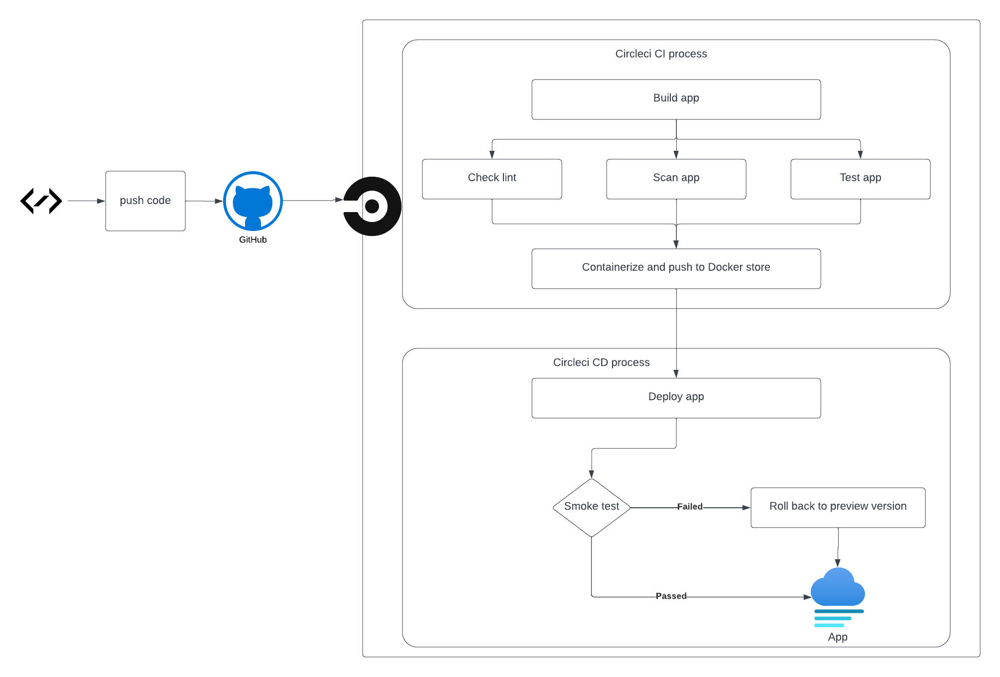

# Udacity - Project capstone

This project using AWS, K8S (EKS), cloudformation and circleCI

- [Github repo](https://github.com/phucla/udacityp-capstone)
- [My webapp deploy](a17e3eb369c9347cda05c744748a1837-9b7ae2c4c411d008.elb.us-east-1.amazonaws.com)

## Pipeline propose diagram



## Tech stack

- [Circle CI](www.circleci.com) - Cloud-based CI/CD service
- [Amazon AWS](https://aws.amazon.com/) - Cloud services
- [AWS CLI](https://aws.amazon.com/cli/) - Command-line tool for AWS
- [CloudFormation](https://aws.amazon.com/cloudformation/) - Infrastrcuture as code
- [Amazon Elastic Kubernetes Service](https://aws.amazon.com/eks/) - The most trusted way to start, run, and scale Kubernetes

## Project results:

- [Project results](results/results.md)

## How to run

### Pre-setup

#### Setup network infrastructures:

```sh
# Create network
./scripts/create-template.sh uda-capstone-network ./infrastructures/network.yml ./infrastructures/network.json

# Update network
./scripts/update-template.sh uda-capstone-cluster ./infrastructures/network.yml ./infrastructures/network.json
```

#### Setup cluster infrastructures:

```sh
# Create cluster
./scripts/create-template.sh uda-capstone-network ./infrastructures/cluster.yml ./infrastructures/cluster.json

# Update cluster
./scripts/update-template.sh uda-capstone-cluster ./infrastructures/cluster.yml ./infrastructures/cluster.json
```

### Run project local

```sh
# Build docker image
chmod +x scripts/upload-docker.sh
scripts/upload-docker.sh latest

# Deploy local
kubectl apply -f k8s/local

# Forwarding port
kubectl port-forward service/uda-app-service 8080:80
```

### Deploy app

```sh
# Update cluster config
aws eks update-kubeconfig --region us-east-1 --name uda-capstone-cluster

# Deploy cluster
kubectl apply -f k8s/prod
```

## Circleci status

[](https://app.circleci.com/pipelines/github/phucla/udacityp-capstone)
