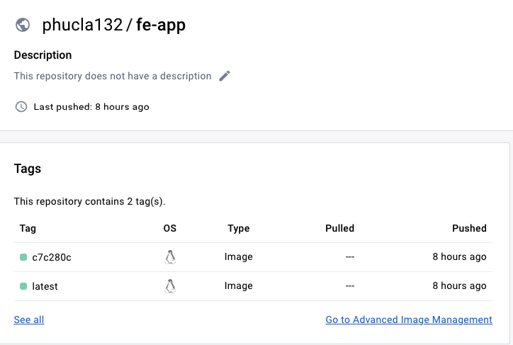
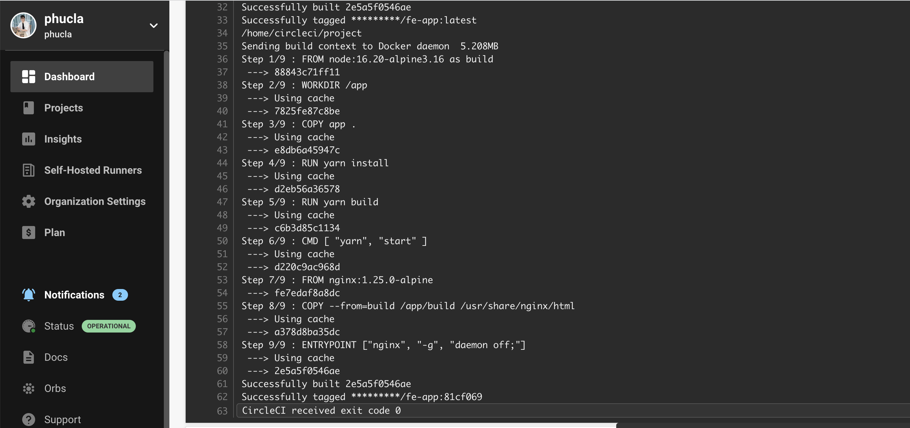
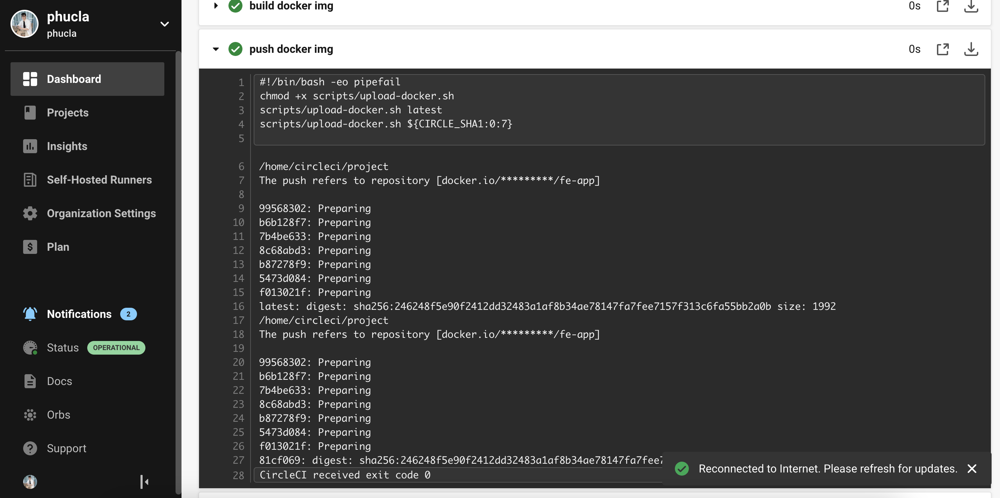
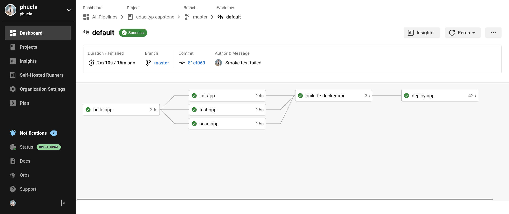
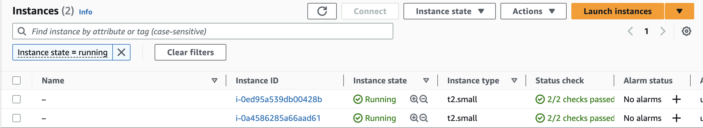
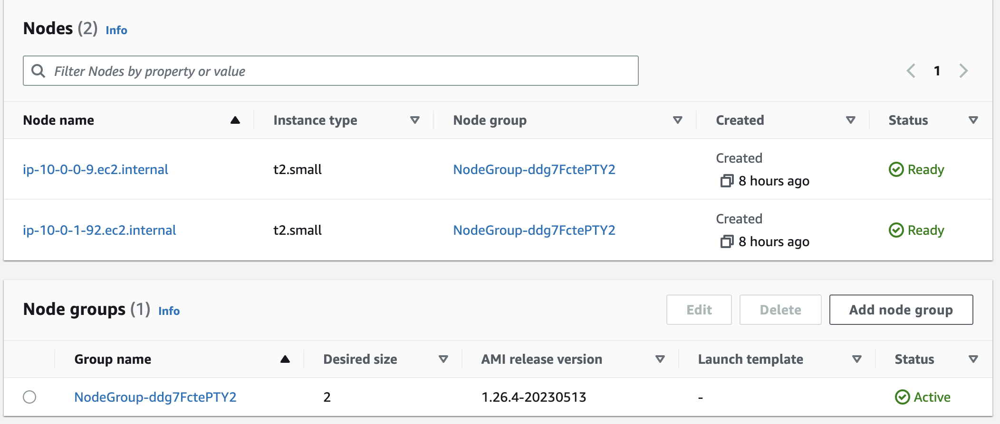
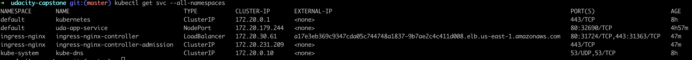
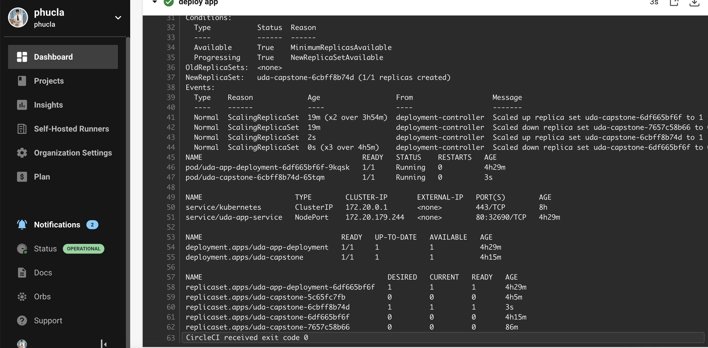
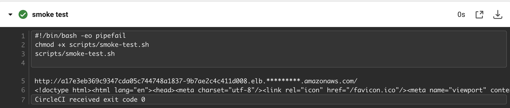

# UDACITY - CAPSTONE RESULTS

## Use image repository to store Docker images

## Execute linting step in code pipeline

### Check lint failed

### Check lint passed

## Build a Docker container in a pipeline

## The Docker container is deployed to a Kubernetes cluster

The cluster is deployed with CloudFormation or Ansible. This should be in the source code of the student’s submission.

### Deploy network

### Deploy cluster

## Use Blue/Green Deployment or a Rolling Deployment successfully

### Screenshot of the Circle CI or Jenkins pipeline showing all stages passed successfully.

### Screenshot of the Circle CI or Jenkins pipeline showing all stages passed successfully.

### Screenshot of your AWS EC2 page showing the newly created (for blue/green) or modified (for rolling) instances running as the EKS cluster nodes.

#### EC2

#### EKS

#### Revert when smoke test failed

### Kubectl deployment is successful

### Screenshot showing that you can access the application after deployment.

